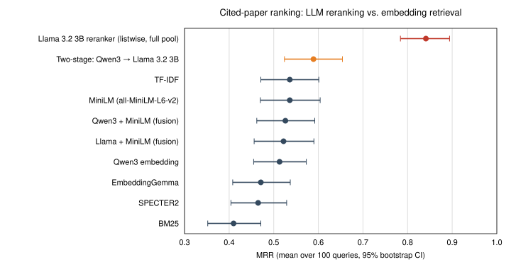

# Does LLM Reranking Help Scientific Paper Recommendation?

**A 9-method benchmark on citation-based relevance, and a deployed two-stage recommender for Boğaziçi University researchers**

Sena Öz · Advisor: H. Birkan Yılmaz · Boğaziçi University, M.S. Software Engineering (SWE 599), 2026
[Final report (PDF)](SWE599_Final_2026S_OZ_Sena.pdf) · [Statistics](research/stats/results.md) · [System setup](README_APP.md) · [Development log](docs/DEVLOG.md)

---

## Summary

Researchers miss relevant work from institutions they don't routinely follow. I built a system that monitors new papers from selected institutions via [OpenAlex](https://openalex.org) and recommends them to Boğaziçi researchers, and I used it to ask a research question:

> **Does reranking embedding-retrieved candidates with a small local LLM improve recommendation quality, and under what conditions?**

**Findings** (100 queries, 95% bootstrap CIs, Holm-corrected paired Wilcoxon tests):

1. **On a fixed candidate pool, a 3B-parameter LLM reranker clearly beats every embedding method.** Llama 3.2 3B reaches MRR 0.84 [0.78, 0.89] vs. 0.51 [0.46, 0.57] for Qwen3 embeddings (p < 10⁻⁷), and ranks a true reference first in 75% of queries vs. 25%.
2. **In the deployed two-stage cascade, most of that gain disappears.** Qwen3 → Llama reaches MRR 0.59, which is *not* significantly better than Qwen3 alone (p = 0.48). Stage-1 recall loss caps what the reranker can recover.
3. **Embedding choice barely matters here.** TF-IDF, MiniLM, Qwen3 and their fusions have heavily overlapping confidence intervals on MRR (pairwise tests p ≈ 1); only BM25 is clearly worse. SPECTER2, despite citation-graph pretraining, ranks below MiniLM on R-precision (p = 0.004).
4. **Less text can be better.** For Qwen3, abstract-only input outperforms title + abstract + concept tags (MRR 0.68 vs. 0.49 in the field ablation).



---

## Benchmark

| | |
|---|---|
| **Task** | Given a query paper, rank candidate papers so that the papers it actually cites appear first |
| **Corpora** | 9,946 post-2020 papers from MIT, Stanford, Harvard, UC Berkeley, U. Michigan, Google, Google DeepMind; 4,608 Boğaziçi papers (OpenAlex, English, non-empty abstract) |
| **Queries** | 174 papers citing 6–14 in-corpus references; 100 sampled for evaluation (seed 42) because the LLM reranker is slow |
| **Candidates per query** | *n* cited references (positives) + 2*n* random non-cited papers, excluding same-author work (negatives): 18–42 candidates |
| **Relevance proxy** | A cited paper is treated as relevant to the citing paper |
| **Metrics** | MRR; R-precision (share of the top-*n* that are true references, *n* = number of positives); nDCG@*n*; Top-1 accuracy |

Construction: [`research/cited_paper_ranking.ipynb`](research/cited_paper_ranking.ipynb) · Per-query rankings: [`research/eval_dataset/week3/`](research/eval_dataset/week3/)

> *Note on naming:* the final report calls R-precision "Hit Rate @ n%". It is renamed here because "hit rate" usually means "at least one relevant item in the top-k", which would not match these values.

## Results

| Method | MRR [95% CI] | R-precision % [95% CI] | nDCG@n | Top-1 % |
|---|---|---|---|---|
| Llama 3.2 3B reranker (listwise, full pool) | **0.841** [0.784, 0.894] | **45.0** [41.3, 48.8] | **0.838** | **75** |
| Two-stage: Qwen3 → Llama 3.2 3B (deployed design) | 0.589 [0.524, 0.654] | 37.0 [34.4, 39.7] | 0.681 | 38 |
| TF-IDF | 0.536 [0.471, 0.601] | 33.4 [30.6, 36.3] | 0.629 | 32 |
| MiniLM (all-MiniLM-L6-v2) | 0.536 [0.470, 0.604] | 35.9 [32.6, 39.2] | 0.632 | 33 |
| Qwen3 + MiniLM (fusion) | 0.526 [0.462, 0.592] | 37.2 [34.1, 40.4] | 0.640 | 30 |
| Llama + MiniLM (fusion) | 0.522 [0.456, 0.590] | 34.5 [31.5, 37.5] | 0.633 | 30 |
| Qwen3 embedding | 0.513 [0.455, 0.573] | 37.4 [34.6, 40.2] | 0.642 | 25 |
| EmbeddingGemma | 0.471 [0.408, 0.537] | 34.0 [30.8, 37.0] | 0.603 | 25 |
| SPECTER2 | 0.465 [0.404, 0.529] | 30.2 [27.1, 33.4] | 0.582 | 24 |
| BM25 | 0.410 [0.352, 0.471] | 23.1 [20.8, 25.4] | 0.528 | 18 |

Significance tests for the comparisons discussed above: [`research/stats/results.md`](research/stats/results.md).

**Field ablation (Qwen3 embeddings, 100 queries)**

| Input fields | MRR | R-precision (0–1) | nDCG@n |
|---|---|---|---|
| Title only | 0.493 | 0.339 | 0.324 |
| **Abstract only** | **0.684** | **0.460** | **0.474** |
| Title + Abstract | 0.613 | 0.437 | 0.434 |
| Title + Abstract + Concepts | 0.485 | 0.339 | 0.324 |

*From a separate run reported in the final report (Table 4.3); absolute values differ slightly from the main table.*

## Limitations

- **Citation is a proxy for relevance.** Researchers may find uncited papers relevant and cited ones irrelevant. No human relevance judgments yet.
- **The comparison is not like-for-like.** The LLM ranks all candidates jointly in one prompt (listwise); embeddings score each candidate independently (pointwise).
- **Random negatives are easy.** Topically close but uncited papers (hard negatives) would make the task more realistic.
- **One LLM run.** Generative reranking is stochastic; results over multiple seeds are pending.
- **Possible pretraining contamination.** The LLM may have seen these papers and their reference lists during pretraining.
- **100 of 174 queries** were evaluated, for cost reasons.

## Next step: human-centered evaluation

The deployed system already records thumbs-up/down feedback on each paper–researcher match. The next question is whether **offline ranking quality predicts what researchers actually find useful**, and how researchers judge and trust LLM-produced recommendations compared with similarity scores. A small study with Boğaziçi researchers using this feedback is planned.

---

## The system

A fully containerized recommender that runs the two-stage pipeline every six hours:

1. **Fetch** new papers from followed institutions (OpenAlex API, cursor-based incremental fetching).
2. **Stage 1, Retrieve:** Qwen3 embeddings (`qwen3-embedding`, 4096-d, stored in PostgreSQL with pgvector); cosine similarity against ~7,800 Boğaziçi paper embeddings; top-10 researchers above a 0.3 threshold.
3. **Stage 2, Rerank:** Llama 3.2 3B (Ollama) decides `RELEVANT <score>` / `IRRELEVANT <score>` for each candidate researcher. Falls back to Stage-1 scores if the LLM is unavailable.
4. **Serve** a React 19 + TypeScript interface: paper feed, researcher pages, institution following, relevance feedback, admin panel.

Stack: FastAPI · SQLAlchemy (async) · PostgreSQL 16 + pgvector · Ollama · React 19 · Vite · Tailwind · Docker Compose. Setup instructions: [`README_APP.md`](README_APP.md).

## Reproduce the analysis

```bash
git clone https://github.com/senaoz/SWE-599.git && cd SWE-599
pip install -r research/requirements.txt
python research/stats/significance.py      # recomputes all tables, CIs and tests above
```

Re-running the retrieval methods themselves requires [Ollama](https://ollama.com) with `qwen3-embedding` and `llama3.2:3b`, and the notebooks in [`research/`](research/).

## Repository structure

```
research/
  src/                         similarity.py (all methods) · metrics.py · preprocessing.py
  cited_paper_ranking.ipynb    benchmark construction + evaluation
  similarity_evaluation.ipynb  pipeline sanity checks
  eval_dataset/week3/          per-query rankings for every method
  stats/                       significance.py · results.md · mrr_ci.svg
backend/                       FastAPI service, scheduler, matching pipeline
frontend/                      React application
docs/DEVLOG.md                 week-by-week development log
SWE599_Final_2026S_OZ_Sena.pdf final report
```

## Citation

```bibtex
@techreport{oz2026llmrerank,
  author      = {Sena {\"O}z},
  title       = {Does LLM Reranking Help Scientific Paper Recommendation? A Nine-Method Citation Benchmark and a Deployed Two-Stage Recommender},
  institution = {Bo{\u{g}}azi{\c{c}}i University},
  year        = {2026},
  type        = {M.S. Term Project Report (SWE 599)}
}
```
